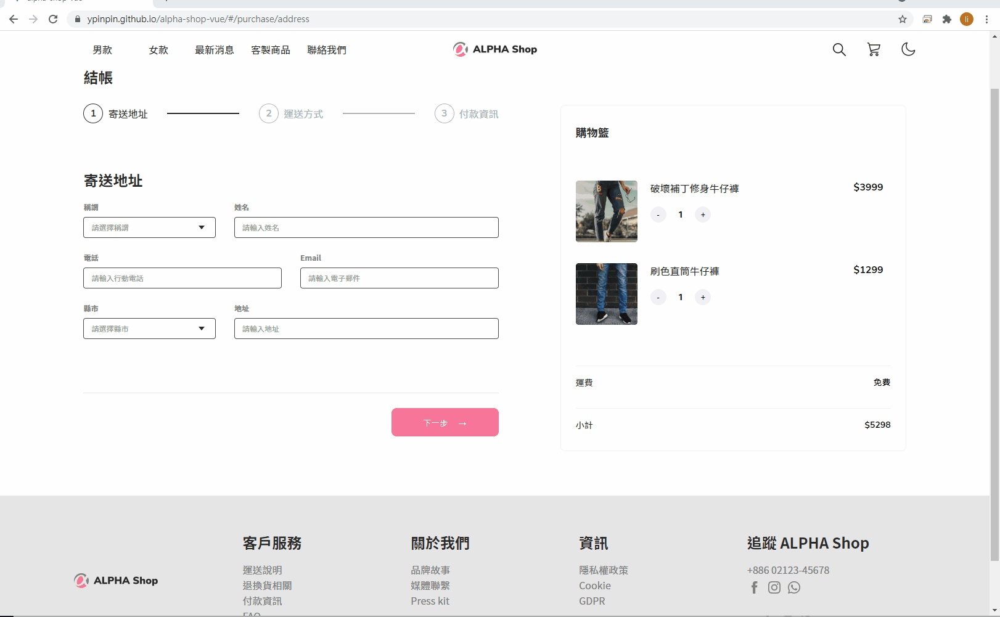

# alpha-shop-vue

AlphaCamp Project : ALPHA-Shop Vue 版練習
切版練習版本：https://github.com/YPINPIN/ALPHA-Shop

## 畫面演示

https://ypinpin.github.io/alpha-shop-vue/




## 本機運行專案

### 1. 開啟終端機(Terminal)，Clone 此專案至本機

```
git clone https://github.com/YPINPIN/alpha-shop-vue.git
```

### 2. Terminal 輸入以下指令進入專案

```
cd alpha-shop-vue
```

### 3. Terminal 輸入以下指令安裝 npm 套件

```
npm install
```

### 4. 開發編譯

```
npm run serve
```

### 5. 根據 Terminal 提供的網址進行連線，例：http://localhost:8080/

### 6. 於 Terminal 按`Ctrl`+`c`結束連線

## 製作紀錄

以下是製作時間紀錄：

- 專案初始化相關檔案、Sass 使用設定測試：約 1.5 小時
- header 及 footer 元件、style.scss、asset 圖片載入設定 mixins： 約 2 小時
- 規劃購物車頁面元件拆分：約 20 分鐘
- stepper 元件、資料、樣式設定： 約 1 小時
- 表單 address, delivery, payment 路由、頁面切換初始設定： 約 2 小時
- 修改巢狀 router-view、初始表單資料數據、按鈕點擊控制表單提交檢查： 約 5 小時
- 購物車元件、增減商品資料、價格顯示功能： 約 2 小時
- 添加組件（Modal）顯示購物車數據： 約 1.5 小時
- 修改表單步驟、購物車產品本地存儲 & 路由步驟檢查： 約 3.5 小時

## 環境建置

- [Visual Studio Code](https://code.visualstudio.com/)
- [Node Version Manager (nvm) for Windows](https://github.com/coreybutler/nvm-windows/releases)
- 使用 nvm 安裝 Node.js v14.17.1
- [Vue CLI](https://cli.vuejs.org/)

## 專案開發人員

> [YPINPIN](https://github.com/YPINPIN)

# 技術參考

### [Vue CLI 專案中引入 SCSS 檔案的四種方法](https://medium.com/unalai/vue-%E5%B0%88%E6%A1%88%E4%B8%AD%E5%BC%95%E5%85%A5-scss-%E6%AA%94%E6%A1%88%E7%9A%84%E5%9B%9B%E7%A8%AE%E6%96%B9%E6%B3%95-%E8%A9%B2%E5%A6%82%E4%BD%95%E4%BD%BF%E7%94%A8%E5%91%A2-9babcd3a4ef1)

### [[Webpack][Vue.js] 動態編譯 assets 嘗試](https://yuugou727.github.io/blog/2018/04/09/webpack-vue-dynamic-assets/)

### [Vue 圖片路徑問題](https://medium.com/@franklion1227/vue-js-%E5%9C%96%E7%89%87%E8%B7%AF%E5%BE%91%E5%95%8F%E9%A1%8C-907d6af6fe88)

### [代碼服務－縣市清單](https://data.gov.tw/dataset/101905)

### [Submit a form in vue](https://stackoverflow.com/a/61882627)

### [Modals with forms and validation on vue.js 2](https://vuejsexamples.com/modals-with-forms-and-validation-on-vue-js-2/)

### [Vue Transitions](https://vuejs.org/v2/guide/transitions.html)

### [Vue Slot 是什麼? 怎麼用?](https://medium.com/itsems-frontend/vue-slot-21e1ec9968f8)
